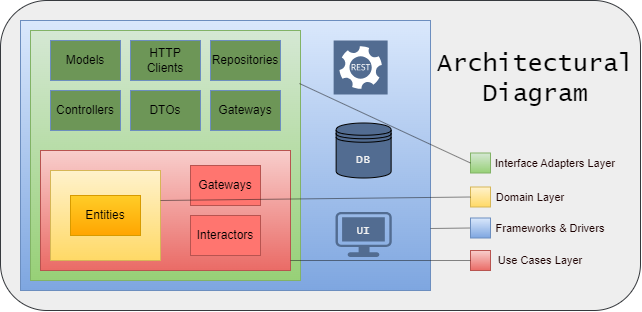

# Installation Guide

## 1. Running the Application with Docker Compose

### Prerequisites
- [Docker Desktop](https://www.docker.com/products/docker-desktop/)

### Steps

#### 1. Obtain an API Key for the Chat Completion Service
The API connects to the Llama3-8b-8192 model provided by Groq Cloud. To acquire an API key,
follow [these instructions](https://console.groq.com/keys) and add the key to the `GROQ_CLOUD_API_KEY`
environment variable in the `docker-compose.yaml` file.

#### 2. Starting Containers
Run the following command to start the containers:
```bash
docker-compose up -d
```
>Note: A .jar file of the current API version is already available in the src directory,
> so there's no need to manually configure a Docker image for the Spring API. Ensure that
> the ports mapped to the host in docker-compose.yaml are not in use by other processes.

## 2. Running the Application with Maven

### Prerequisites
- [Docker Desktop](https://www.docker.com/products/docker-desktop/)
- [Java 21](https://www.oracle.com/br/java/technologies/downloads/#java21)
- [Apache Maven 3.9.8 or later](https://maven.apache.org/install.html)

### Steps

#### 1. Start the PostgreSQL Database Container
```bash
docker-compose up db -d
```

#### 2. Create application-dev.properties
The `application.properties` file is configured to run the Spring `dev` profile by default.
To enable this, create a file named `application-dev.properties` in `src/main/resources` with the
following settings:
```properties
server.port=8080

spring.datasource.url=jdbc:postgresql://localhost:3003/lol
spring.datasource.username=postgres
spring.datasource.password=1234
spring.datasource.driver-class-name=org.postgresql.Driver

spring.jpa.open-in-view=false
spring.jpa.hibernate.ddl-auto=none

groq-cloud.base-url=https://api.groq.com/openai

# Replace this with your API key
groq-cloud.api-key=your_api_key
```

>Note: Make sure to obtain an API key as shown [here](#1-obtain-an-api-key-for-the-chat-completion-service)
> and assign it to `groq-cloud.api-key`. The database settings above are provided for example purposes.
> If you choose to modify them, ensure that the database settings in `docker-compose.yaml` are updated accordingly.

#### 3. Run the Application
In the project root directory, run:
```bash
mvn clean install -DskipTests
mvn spring-boot:run
```
## Architecture
The project follows the Clean Architecture principles, as illustrated below.



It includes five main directories:
- `application`: Contains use cases and interfaces for accessing resources such as databases and HTTP clients.
- `domain`: Defines system entities and business-rule exceptions.
- `infrastructure` Implements the application layer's gateways, providing access to database
- repositories, HTTP client interfaces, controllers, DTOs, framework-specific exceptions,
- and other Spring resources.
- `configuration` Holds configuration files with dependency injection beans.
- `shared`  Contains utility classes accessible across multiple layers.

# Tests
## Coverage
Current coverage includes:
- Classes: 81%
- Methods: 71%
- Lines: 78%

Additionally, controllers and interactors (use cases) have 100% coverage across all metrics as
measured by IntelliJ IDEA's [Code Coverage](https://www.jetbrains.com/help/idea/code-coverage.html#run_with_coverage) plugin.

## Running Tests
### Prerequisites
- [Java 21](https://www.oracle.com/br/java/technologies/downloads/#java21)
- [Apache Maven 3.9.8 or latest](https://maven.apache.org/install.html)
- [Docker-desktop](https://www.docker.com/products/docker-desktop/) (required for integration tests)

Run the following commands in the terminal:

- For unit tests:
```bash
mvn test
```
- For integration tests:
```bash
mvn verify -Pfailsafe
```
>Note: Ensure Docker is running, as the application uses TestContainers to create a PostgreSQL database
> in Docker for each integration test class.

# OpenAPI Documentation
To view the full documentation of the API endpoints and schemas, go to `/swagger-ui/index.html`.
To access the API documentation in JSON format for API clients like Postman, Insomnia, and others,
use the endpoint `/v3/api-docs`.